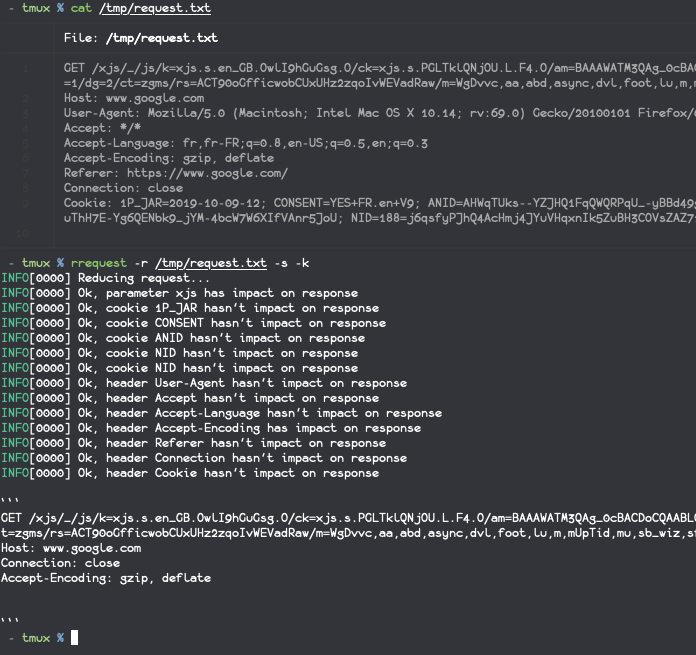

# ReduceRequest

Reduce a (burp) HTTP request file to strict minimum

Just because not all headers, parameters, cookies are necessary.

## Demo



## Usage

```
usage: rrequest [-h|--help] -r|--request-file <file> [-x|--http-proxy
                "<value>"] [-s|--ssl] [-k|--disable-check-cert]

                Reduce (Burp) HTTP Request File

Arguments:

  -h  --help                Print help information
  -r  --request-file        Request File to reduce
  -x  --http-proxy          HTTP proxy to send the requests through
  -s  --ssl                 Forces SSL
  -k  --disable-check-cert  Disable SSL cert checks
```

## Install

Download release here: [https://github.com/SakiiR/rrequest/releases](https://github.com/SakiiR/rrequest/releases)

Copy the binary in a path within \$PATH: (e.g. `/usr/local/bin/rrequest`)

## TODO

* Parse Body Content
  - JSON
  - form-URL-encoded
  - XML ?
* Parse URL parameters 
